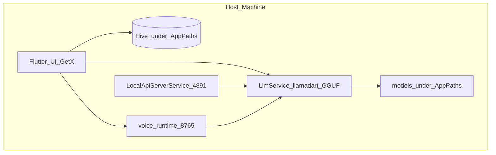
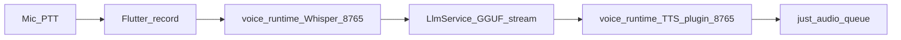

# ARCHITECTURE.md — System architecture

## High-level

See [ROADMAP.md](ROADMAP.md) for platform scope (Mode V voice is macOS-first).

## Flutter app layers

| Layer | Path | Role |
|-------|------|------|
| Entry | `lib/main.dart` | Hive init, error zones, `GetMaterialApp` |
| Bindings | `lib/bindings/` | GetX DI registration |
| Controllers | `lib/controllers/` | UI state, chat/model/theme |
| Services | `lib/services/` | LLM, models, API server, storage, logs |
| Screens | `lib/screens/` | Full pages / tabs |
| Widgets | `lib/widgets/` | Reusable UI pieces |
| Models | `lib/models/` | Hive + JSON data classes |
| Theme | `lib/theme/` | Colors / ThemeData |
| Routes | `lib/routes/` | Named routes |

### Key services

- **`ModelManager`** — catalog from `assets/models_catalog.json`, download GGUF, scan disk.
- **`LlmService`** — load/unload GGUF, token stream generation.
- **`ChatStorageService`** — chats, settings, local API prefs.
- **`LocalApiServerService`** — OpenAI-compatible HTTP:
  - `GET /healthz`
  - `GET /v1/models`
  - `POST /v1/chat/completions` (stream + non-stream)

### Local data root

Same folder layout on every platform; only the **root** changes:

| Platform | Root |
|----------|------|
| macOS / Linux | `~/.uncensored-ai/` |
| Windows | `%USERPROFILE%\.uncensored-ai\` |
| iOS / Android | `<ApplicationSupport>/uncensored-ai/` (app sandbox) |

| Subdir | Contents |
|--------|----------|
| `hive/` | Chat + settings Hive boxes |
| `models/` | GGUF weights |
| `voice/` | Temp STT/TTS wavs |
| `logs/` | Reserved |
| `cache/` | Reserved |

USB layout (if present) still overrides models on desktop: `../Shared/models` relative to executable.  
Catalog: `assets/models_catalog.json`. Desktop first launch migrates legacy `~/Documents/PortableAI/models` and Documents Hive files into the new root.

## Local OpenAI API contract (host)

Base URL: `http://127.0.0.1:4891/v1`  
Auth: any non-empty Bearer token (e.g. `local`).  
Prerequisite: model loaded + server enabled in Settings.

Voice and external tools should prefer this API over calling `LlmService` directly so one surface stays stable.

## Voice architecture (Mode V)

**Goal:** in-app local voice chat with chat-worthy latency on macOS.

1. Tap mic in Flutter → PCM stream → WAV under AppPaths `voice/`
2. `POST http://127.0.0.1:8765/transcribe` (faster-whisper tiny)
3. Stream `LlmService.generate` (Gemma in-process; short spoken system hint)
4. On each sentence → `POST /speak` (pluggable TTS)
5. Queue wav chunks with `just_audio` while next sentence synthesizes

**TTS plugins** (`voice_runtime/tts/`, env `VOICE_TTS_BACKEND`):

| Backend | Role |
|---------|------|
| `chatterbox_nano` | Trial default — expressive / paralinguistic tags |
| `chatterbox_turbo` | Larger Chatterbox Turbo |
| `chatterbox_mtl_v3` | Multilingual V3 (`language_id` on `/speak`) |
| `kokoro` | **Named fallback** — current Kokoro ONNX stack |

If Chatterbox fails to load, runtime auto-falls back to `kokoro` (`tts.fallback_used` in `/health`).

Docker Fish (`voice_services/`) was removed from the tree — not a product path.

### Latency principles

- Stream LLM tokens; never wait for full completion before first TTS.
- TTS per sentence; overlap playback with next synthesis.
- Cap reply length for voice via spoken system hint.
- Keep `kokoro` available when expressive backends are too slow.

### Pilot gate (measured on host)

- Kokoro: `voice_runtime/pilot/out/bench_report.json`
- Backend compare: `voice_runtime/pilot/out/tts_backends_report.json` (`python pilot/bench_tts_backends.py`)

## Platform notes

- **macOS:** Mode V voice + mic entitlement (`com.apple.security.device.audio-input`); data in `~/.uncensored-ai/`.
- **Android/iOS:** Text chat primary; voice Mode V not shipped yet; data in app support `uncensored-ai/`.
- **Windows/Linux:** Text chat; Mode V packaging planned (see roadmap).

## Extension points (safe)

- New catalog models → `assets/models_catalog.json`
- New GetX service → register in `AppBindings`, document in `lib/services/AGENTS.md`
- Voice runtime changes → `voice_runtime/` + [ROADMAP.md](ROADMAP.md) platform notes
